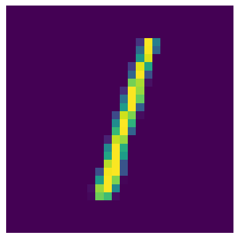

# MNIST Training
This tutorial shows how you can train a simple neural network using `pypely`, to classify MNIST pictures. The MNIST data consists of hand written numbers and corresponding labels describing which number between 0-9 is displayed on the image. The following table shows a snippet of the dataset:

<table>
  <tr>
    <th>Image</th>
    <td></td>
    <td></td>
    <td></td>
    <td></td>
    <td></td>
  </tr>
  <tr>
    <th>Label</th>
    <td>7</td>
    <td>2</td>
    <td>1</td>
    <td>0</td>
    <td>4</td>
  </tr>
</table>

## PyTorch
The [PyTorch](https://pytorch.org/) library is used to create the neural network. The model is defined in [models.py](src/ds/models.py). 

## Tensorboard
To see the training progress and corresponding metrics use tensorboard. To start tensorboard run:

```shell
tensorboard --logdir=runs
```

## Execution
Please be sure that you ran `source .env` before you start [main.py](src/main.py). [.env](../../.env) is located in the root of the project.
