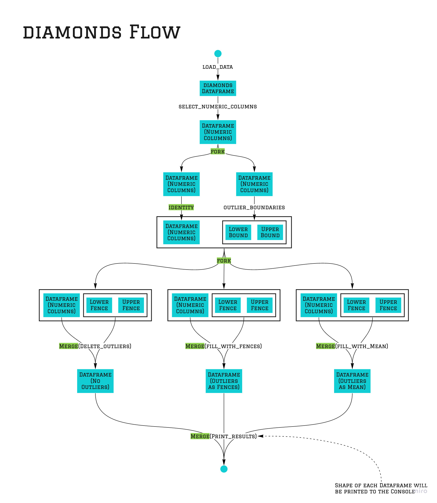

 * [Step by Step Data Preprocessing](https://www.kaggle.com/agrawaladitya/step-by-step-data-preprocessing-eda)
 * [Toxic Data Preprocessing](https://www.kaggle.com/fizzbuzz/toxic-data-preprocessing)
 * [Data Preprocessing Guide](https://www.kaggle.com/berkayalan/data-preprocessing-a-complete-guide)

The code written in the examples is inspired by the referenced notebooks. 

# Preprocessing
The two files [feature_engineering.py](./src/feature_engineering.py) and [outlier_handling.py](src/outlier_handling.py) demonstrate how `pypely` can be used for preprocessing tasks. The to examples are refering to two kaggle examples. Eventhough the code refers to these examples the purpose of the examples in this repo can not be compared with the original purpose of the notebook code. All visualizations will be left out. You can understand the translation from the notebook to the example as if you did exploration and want to transform your code into a productive, reusable and extendable setup.  


## Outlier Handling

 In [outlier_handling.py](src/outlier_handling.py) we will use this [kaggle guide](https://www.kaggle.com/berkayalan/data-preprocessing-a-complete-guide) and try to apply the `pypely` approach for the described data processing. Please take a look at the guide so that you will know why the data preprocessing is done. This guide here only focuses on applying the `pypely` approach.

### Building a Pipeline
The following graphic demonstrates the pipeline that is built in [outlier_handling.py](./outlier_handling.py). Intermediate outputs that are not visible in the code are displayed here. Additionally each section where `pypely` code is applied is highlighted.



### Level of abstraction
Functional programming provides multiple ways of abstraction. Choose the level of abstraction that is applicable for your problem. Mostly you might want to choose between 

>"Configurable & Reusable" vs "Simple & Readable"

#### Everything in `pypely` mode
Of course it is possible to go fully functional and using `pypely` therefore. The function `outlier_boundaries` could have also been defined as shown in the following:

```python
def outlier_boundaries(df):
    def __fences(lower_fence, upper_fence):
        return lambda quantiles, IQR: Boundaries(
            lower=lower_fence(quantiles[0], IQR), 
            upper=upper_fence(quantiles[1], IQR)
        )

    pipe = pipeline(
        fork(
            calculate_quantile(0.25),
            calculate_quantile(0.75)
        ),
        fork(
            identity,
            lambda x: x[1] - x[0]
        ),
        merge(
            __fences(
                calculate_fence(aggregation=lambda x, y: x - y, factor=1.5),
                calculate_fence(aggregation=lambda x, y: x + y, factor=1.5),
            )
        )
    )

    return pipe(df)
```

With the two configurable helper functions

```python
def calculate_quantile(quantile):
    return lambda df: df.quantile(quantile)


def calculate_fence(aggregation, factor):
    return lambda quantile, _range: aggregation(quantile,  factor * _range)
```

The advantage of this approach is to have the calculations of the quantile and the fences in one place and configurable. But of course the readability suffers compared to the chosen definition:

```python
def outlier_boundaries(df):
    quantile_1 = df.quantile(0.25)
    quantile_3 = df.quantile(0.75)
    IQR = quantile_3 - quantile_1

    return Boundaries(
        lower=quantile_1 - 1.5 * IQR,
        upper=quantile_3 + 1.5 * IQR
    )
```

#### Parameterized functions
An other way of abstraction is used to fill the datapoints that are outliers. There is one function that discribes how outliers are found and how they are replaced in a given dataset:

```python
def fill_outliers(fill_lower, fill_upper):
    def __fill_outliers(df, fences, fill_lower, fill_upper):
        df[(df < fences.lower).any(axis=1)] = fill_lower(df, fences)
        df[(df > fences.upper).any(axis=1)] = fill_upper(df, fences)

        return df

    return lambda df, fences: __fill_outliers(df, fences, fill_lower, fill_upper)
```

This function takes two functions as arguments. And these two functions define which values will be used to fill the outlier. So the function `fill_outliers` can be used to create new functions that then will actually be applied to the dataframe and the calculated fences. 

In `main` two functions are created with the help of `fill_outliers`.

```python
fill_with_fences = fill_outliers(
    fill_lower=lambda df, fences: fences.lower,
    fill_upper=lambda df, fences: fences.upper,
)

fill_with_mean = fill_outliers(
    fill_lower=lambda df, fences: df.mean,
    fill_upper=lambda df, fences: df.mean,
)
```

## Feature Engineering
The second example refers to [this kaggle example](https://www.kaggle.com/agrawaladitya/step-by-step-data-preprocessing-eda). Again it might be useful to take a look at the notebook. [feature_engineering.py](src/feature_engineering.py) applies `pypely` to the code from the sections **Data Cleaning & Pre-processing** and **Feature Engineering**.

### The Main Pipeline
The complete process is defined by the following code snippet:

```python
process = pipeline(
    load_data,
    rename_columns,
    sort_columns,
    clean_data,
    add_first_time_user,
    hips_to_bins,
    remove_unrequired_entries,
)

df = process()
``` 


### Sub Pipelines
Each of the defined steps is a custom function that again may be defined by a `pipeline`. The biggest part of the whole is taken by `clean_data`:

```python
def clean_data(df):
    return pipeline(
        height_to_centimeter,
        column_to_category("bra_size"),
        column_to_category("shoe_size"),
        column_to_category("shoe_width"),
        column_to_category("cup_size"),
        cast_column_to_type("quality", "category"),
        cast_column_to_type("category", "category"),
        cast_column_to_type("fit", "category"),
        fill_na_in_column("review_summary", "Unknown"),
        fill_na_in_column("review_text", "Unknown"),
    )(df)
```

### Reusability
It can be seen that functions are reused and applied to multiple columns. The most used function `column_to_category` fills empty entries with `"Unknown"` and casts the column to type `category`:

```python
def column_to_category(column):
    return pipeline(
        fill_na_in_column(column, "Unknown"),
        cast_column_to_type(column, "category")
    )
```

The function itself reuses the functions `fill_na_in_column` and `cast_column_to_type`. 
