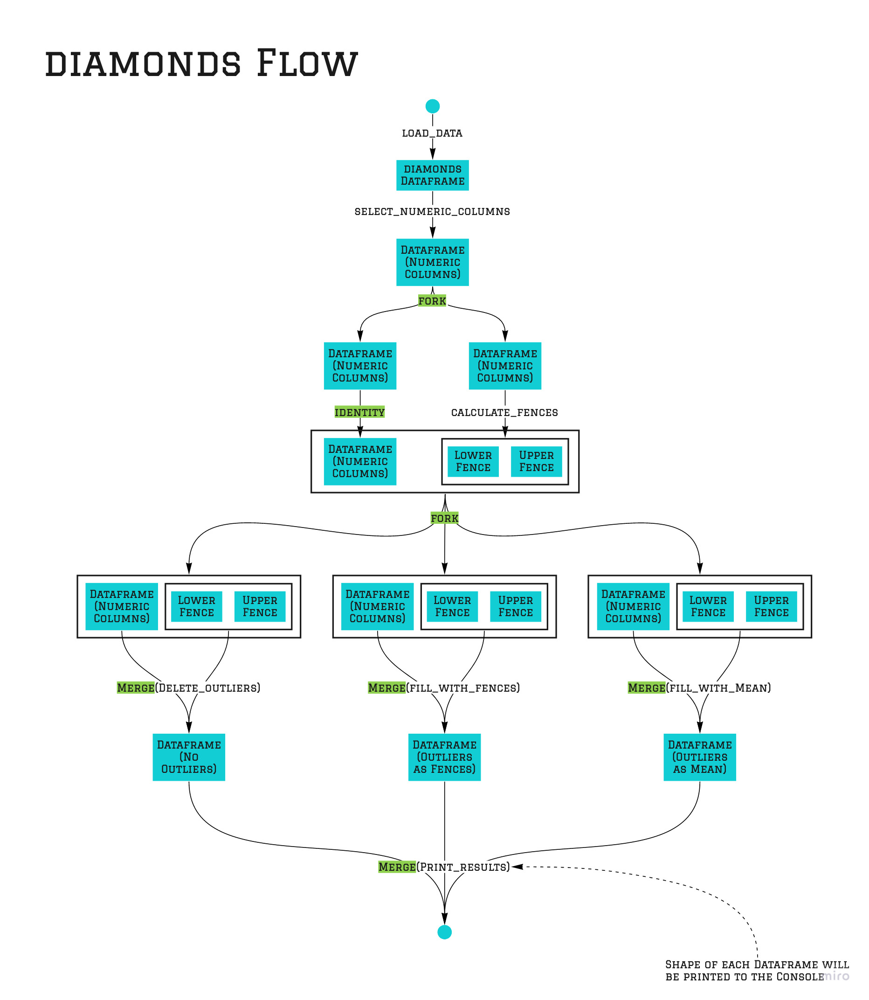

# Data Preprocessing- A Complete Guide 💯✔️ 

Here we will use this [kaggle guide](https://www.kaggle.com/berkayalan/data-preprocessing-a-complete-guide) and try to apply the `pypely` approach for the described data processing. Please take a look at the guide so that you will know why the data preprocessing is done. This guide here only focuses on applying the `pypely` approach.

# Building a Pipeline
The following graphic demonstrates the pipeline that is built in [outlier_handling.py](./outlier_handling.py). Intermediate outputs that are not visible in the code are displayed here. Additionally each section where `pypely` code is applied is highlighted.



# Level of abstraction
Functional programming provides multiple ways of abstraction. Choose the level of abstraction that is applicable for your problem. Mostly you might want to choose between 

>"Configurable & Reusable" vs "Simple & Readable"

## Everything in `pypely` mode
Of course it is possible to go fully functional and using `pypely` therefore. The function `outlier_boundaries` could have also been defined as shown in the following:

```python
def outlier_boundaries_hard(df):
    def __fences(lower_fence, upper_fence):
        return lambda quantiles, IQR: Fences(
            lower=lower_fence(quantiles[0], IQR), 
            upper=upper_fence(quantiles[1], IQR)
        )

    pipe = pipeline(
        fork(
            calculate_quantile(0.25),
            calculate_quantile(0.75)
        ),
        fork(
            identity,
            lambda x: x[1] - x[0]
        ),
        merge(
            __fences(
                calculate_fence(aggregation=lambda x, y: x - y, factor=1.5),
                calculate_fence(aggregation=lambda x, y: x + y, factor=1.5),
            )
        )
    )

    return pipe(df)
```

With the two configurable helper functions

```python
def calculate_quantile(quantile):
    return lambda df: df.quantile(quantile)


def calculate_fence(aggregation, factor):
    return lambda quantile, _range: aggregation(quantile,  factor * _range)
```

The advantage of this approach is to have the calculations of the quantile and the fences in one place and configurable. But of course does the readability suffer compared to the chosen definition:

```python
def calculate_fences(df):
    quantile_1 = df.quantile(0.25)
    quantile_3 = df.quantile(0.75)
    IQR = quantile_3 - quantile_1

    return Fences(
        lower=quantile_1 - 1.5 * IQR,
        upper=quantile_3 + 1.5 * IQR
    )
```

## Parameterized functions
An other way of abstraction is used to fill the datapoints that are outliers. There is one function that discribes how outliers are found and how they are replaced in a given dataset:

```python
def fill_outliers(fill_lower, fill_upper):
    def __fill_outliers(df, fences, fill_lower, fill_upper):
        df[(df < fences.lower).any(axis=1)] = fill_lower(df, fences)
        df[(df > fences.upper).any(axis=1)] = fill_upper(df, fences)

        return df

    return lambda df, fences: __fill_outliers(df, fences, fill_lower, fill_upper)
```

This function takes two functions as arguments. And these two functions define which values will be used to fill the outlier. So the function `fill_outliers` can be used to create new functions that then will actually be applied to the dataframe and the calculated fences. 

In `main` two functions are created with the help of `fill_outliers`.

```python
fill_with_fences = fill_outliers(
    fill_lower=lambda df, fences: fences.lower,
    fill_upper=lambda df, fences: fences.upper,
)

fill_with_mean = fill_outliers(
    fill_lower=lambda df, fences: df.mean,
    fill_upper=lambda df, fences: df.mean,
)
```

